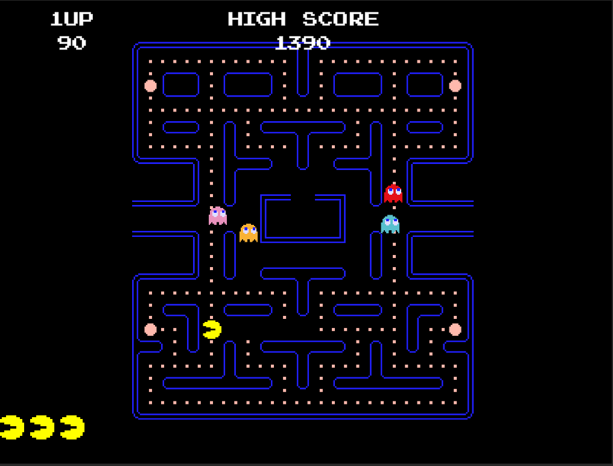

# Unity PacMan
## Trabajo final - Introducción a la creación de videjuegos

Versión en unity de PacMan, uno de los videjuegos más exitosos de la decada de los 80. Para su creación se tuvieron en cuenta aspectos como:

1. Implementación del laberinto y movimiento básico del personaje.
2. Creación de las monedas y power ups consumibles.
3. Implementación de los fantasmas, los roles que cumple cada uno y su inteligencia artificial.
4. Implementación del estado vulnerable de los fantas y su destrucción al ser consumidos.
5. Implementación de la puntuación por partida individual y máxima puntuación general.
6. Implementación del sistema de vidas.
7. Implementación del reinicio del juego luego del gameover.

## Creadores

|Nombre|Correo|
|------|------|
|Jerónimo Ledesma Patiño|jledesmap@unal.edu.co|
|Juan Pablo Cano Ramirez|jcanor@unal.edu.co|
|Mateo Espinal Londoño|maespinallo@unal.edu.co|

**Versión de unity usada**: 2021.2.5.f1

**Sprites tomados de**: [Zigurous](https://github.com/zigurous/unity-pacman-tutorial) 